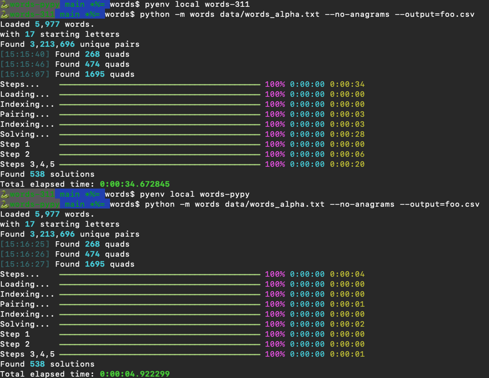

# Five five-letter words with twenty-five unique letters

This code is inspired by the Stand-up Maths channel and Matt Parker's video 
[Can you find: five five-letter words with twenty-five unique letters?](https://youtu.be/_-AfhLQfb6w)
in which he writes some Python code that extracts the desired result somewhat slowly.

Matt's work inspired [Benjamin Paassen](https://gitlab.com/bpaassen/five_clique) to do the same thing using
graph theory to improve the run time to just 22 minutes.

My version goes back to brute forcing the result but with a few optimisations to speed up the Python code.
At the time of writing, given [words_alpha.txt](https://github.com/dwyl/english-words) it will find 538 solutions
excluding anagrams in about 4 seconds on a 2019 Macbook Pro using pypy, or 35 seconds using Python 3.11.

## Installation

Get hold of the word list mentioned above. I'll assume you save it in data/words_alpha.txt

Create a Python virtual environment in whatever way you prefer. 
e.g. Using pyenv to create and activate an environment called `words`

```bash
$ pyenv virtualenv 3.11b0 words
$ pyenv local words
```

Install dependencies. If `poetry` is your thing just do `poetry install`, otherwise if you're a `pip`er do
```bash
$ pip install rich typer
$ pip install -e .
```

Now you should be able to run:
```bash
$ python -m words data/words_alpha.txt
```
This is the basic brute force algorithm. On my macbook it takes about 4 minutes 30 to complete.
At the end it will print out all 831 combinations that it find or you can give it `--quiet` and 
it just tells you how many and how long it took.

Or for a bit of fun use the `--shards` option to split the data up into smaller groups. The more 
groups the faster it might complete but it will take more memory. The parameter is a list of lower
case letters to use as a mask when splitting data. This parameter defaults to splitting on `einot`.

Use --no-anagrams to get only one solution where a word has anagrams instead of one solution for each anagram.




## Algorithm

1. Convert each 5 letter word with distinct letters to a bitset, build a dictionary mapping the resulting bitsets to 
   the set of words that produce each bitset.
2. Index the bitsets so we can quickly access them by the first letter. This step is actually pretty pointless
   but halves the time to build the pairs.
3. Build a set of all 20 bit values that lead to a valid solution. This step is also pretty pointless and makes
   virtually no difference to the overall run time.
4. Build pairs: combine every word with every other word where there are no letters in common. 
   Creates a dictionary mapping the pair bitset to a list of word bitsets that will generate the pair. For each pair
   of words combined to generate a pair only one is stored in the list, the other may be trivially reconstructed.
5. Index the pairs by their first two letters to create a dict {letter_1|letter2: list[pairs]}
6. Combine pairs to give two pairs that have a solution (see below). Returns a list of two-tuples of pairs.
7. Reconstruct the original words from the solution pairs. Print stats and the words.

Bitsets represent sets of letters, just A=1, B=2, C=4, etc. or'ed together giving a 26 bit int.
It's faster to manipulate ints with and/or than it is to manipulate Python sets plus it becomes trivial to extract
the first few letters alphabetically that appear in a bitset (or that don't appear in it).

Step 6 partitions the solutions into 5 scenarios:

Every valid combination contains two pairs and one leftover word but the second pair may use any 
two of the three words available at that point. This means that if we choose any two letters known 
to be in the final three words there must be a pair containing those two letters that may be used 
to build a solution.

A valid solution uses 25 unique letters so there is always exactly one letter not used.

1. **the missing letter is "a".** Choose pair_1 from pairs where the first two letters are "b", "c". 
   Choose pair_2 from pairs where the first two letters not in "a"+pair_1 are in pair_2.

2. **the missing letter is "b".** Choose pair_1 from pairs where the first two letters are "a", "c". 
   Choose pair_2 from pairs where the first two letters not in "b"+pair_1 are in pair_2.

3. **the missing letter is the first letter not in pair_1 (and not "a","b").**
   Choose pair_1 from pairs beginning "a","b". Calculate first, second, third letters not in pair_1. 
   Choose pair_2 beginning second,third not in pair_1.

4. **the missing letter is the second letter not in pair_1 (and not "a","b").**
   As for scenario 3 but choose pair_2 beginning first,third not in pair_1.

5. **the missing letter is not "a", "b", first or second letters not in pair_1 (so all other cases).**
   As for scenario 3 but choose pair_2 beginning first,second not in pair_1.
